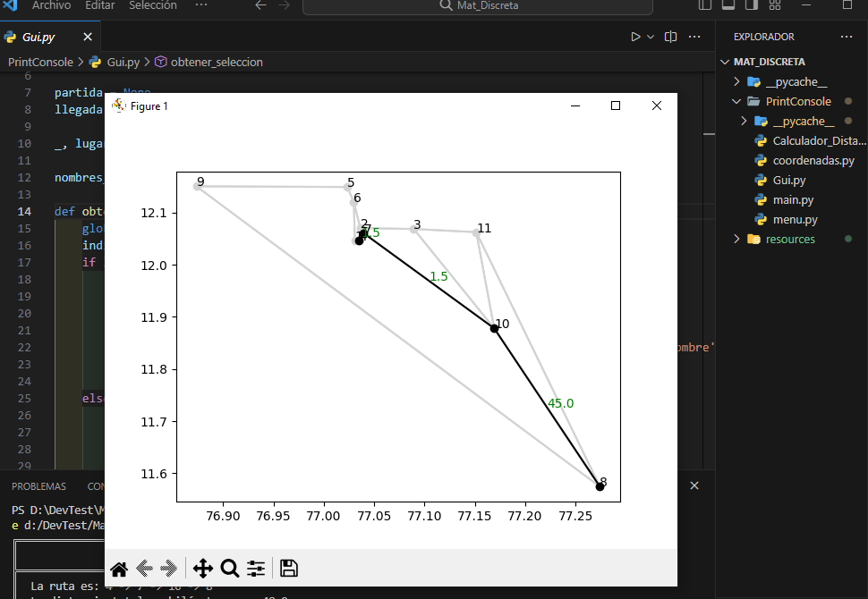

## Proyecto Algoritmo de dijkstra

Este proyecto consta de varios archivos Python que trabajan juntos para proporcionar funcionalidades específicas.

### Archivo [`Calculador_Distancia.py`](PrintConsole/Calculador_Distancia.py)

Este archivo contiene funciones para calcular la distancia entre dos puntos.

### Archivo [`Gui.py`](PrintConsole/Gui.py)

Este archivo contiene el código para la interfaz gráfica de usuario del proyecto.

### Archivo [`coordenadas.py`](PrintConsole/coordenadas.py)

Este archivo contiene funciones para manejar las coordenadas.

### Archivo [`main.py`](PrintConsole/main.py)

Este es el archivo principal que ejecuta el proyecto.

### Archivo [`menu.py`](PrintConsole/menu.py)

Este archivo contiene el código para el menú del proyecto.

## Recursos

El proyecto también incluye una carpeta de recursos que contiene imágenes y otros archivos necesarios para el proyecto.

## Emojis y términos de programación

A lo largo de este proyecto, encontrarás varios emojis y términos de programación. Los emojis se utilizan para añadir un toque de diversión y los términos de programación son esenciales para entender el código.

Por ejemplo, "función" se refiere a un bloque de código reutilizable, y "librería" se refiere a un conjunto de funciones que se pueden utilizar en varios proyectos.

``Proyecto by Boolean``